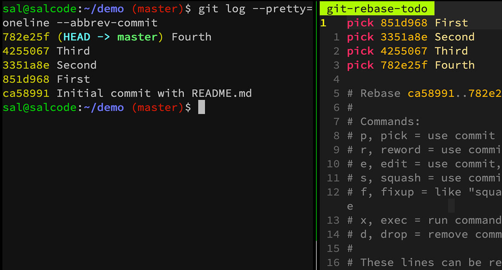
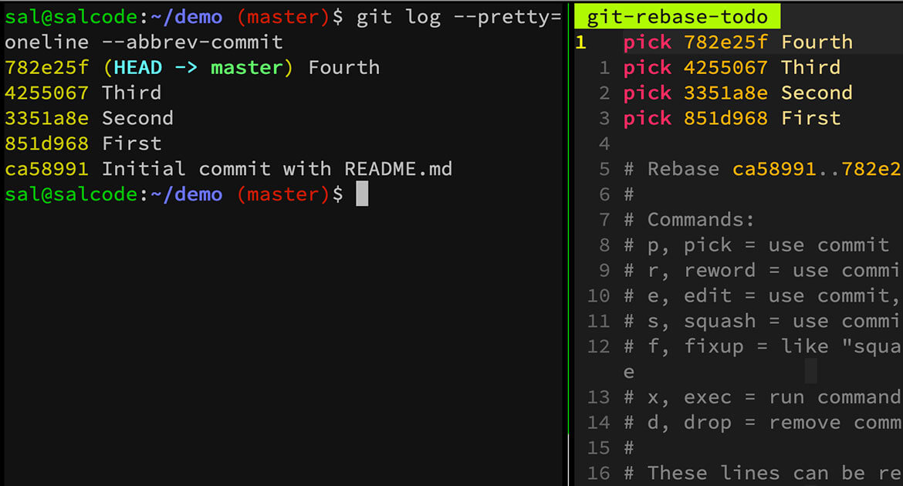

# Interactive Rebase Reverse Vim

A Vim plugin to reverse the order commits are displayed during a Git interactive rebase.

This plugin is based on my difficultly with mentally shifting from
`git log` (where the most recent commit appears at the top)
to `git rebase --interactive` (where the most recent commit appears at the bottom).

For more information, see my post on why the [Git Interactive Rebase Order is Wrong](https://salferrarello.com/git-interactive-rebase-order-is-wrong).

## Demo

### Default Interactive Git Rebase Order

For `git log` (on the left), the newest commit is on the top but for `git rebase --interactive` (on the right), the newest commit is on the bottom.

### Interactive Git Rebase Order with Plugin

The newest commit is on the top for both `git log` and `git rebase --interactive` because this plugin modifies the order for the interactive rebase.

## Author

[Sal Ferrarello](https://salferrarello.com) / [@salcode](https://twitter.com/salcode)
